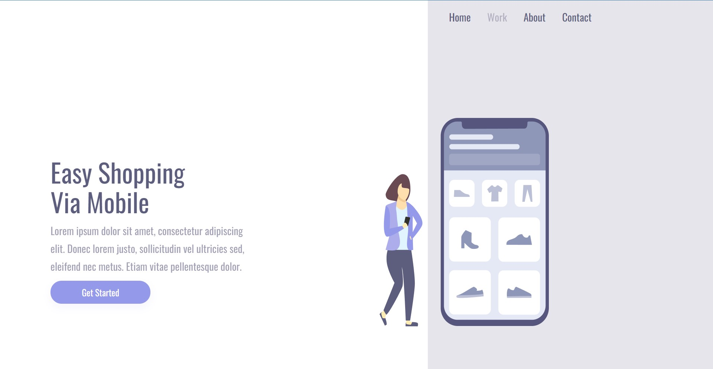
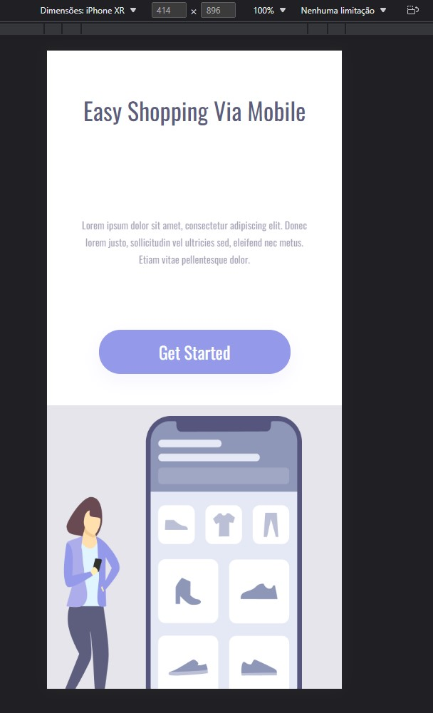

# Interface-Easy-web

### Ajustes e melhorias

O projeto ainda está em desenvolvimento e as próximas atualizações serão voltadas nas seguintes tarefas:

- [x] Layout
- [x] HTML/5 
- [x] CSS/3

> Está interface foi desenvolvida para  Web e cell 

## 🤝 Desenvolvedor 

<table>
  <tr>
    <td >
      <a href="https://www.linkedin.com/in/isaiassouzasantos/">
         
        
          <b>Isaias souza</b>
        
      </a>
    </td>
  </tr>
</table>

